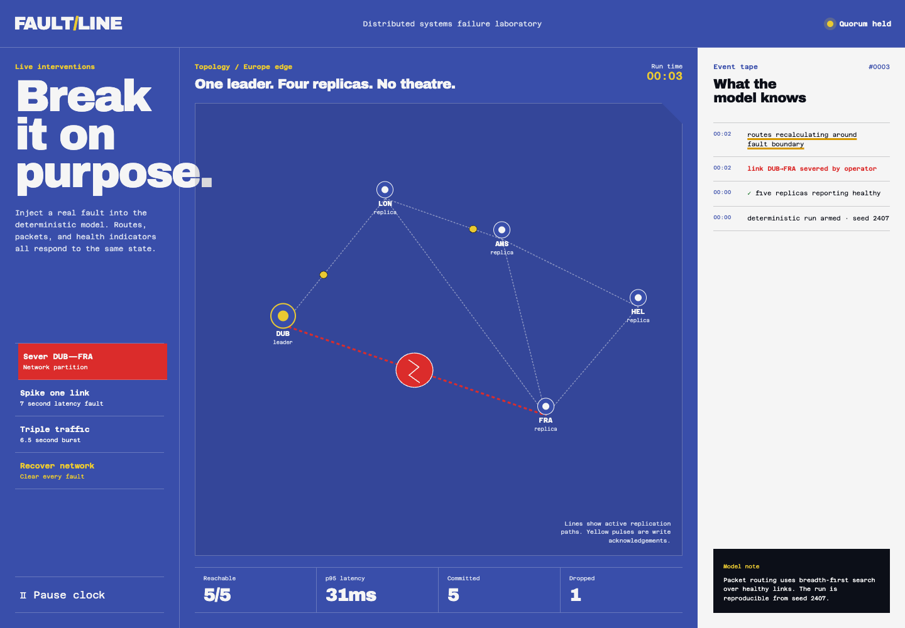

# Faultline

An interactive distributed-systems chaos lab for the browser.

Faultline makes network failure inspectable. It runs a deterministic five-node replication model, routes packets over the live topology, and lets the operator inject partitions, latency, and traffic bursts. The topology, event tape, latency, dropped writes, and quorum indicator all read from the same simulation state.



## Why this exists

Most distributed-systems demos explain failure with a diagram after the fact. Faultline lets you cause the failure and watch the consequences arrive together.

## Technical highlights

- Deterministic seeded simulation written in TypeScript
- Breadth-first routing over a fault-aware graph
- Real-time packet lifecycle and quorum calculation
- SVG topology driven by the engine rather than decorative animation
- Accessible textual topology summary and live status announcements
- Complete keyboard support and reduced-motion mode
- Zero runtime dependencies beyond React

## Run it

```bash
npm install
npm run dev
```

## Verify it

```bash
npm test
npm run build
```

Production Lighthouse: **99 performance · 100 accessibility · 100 best practices**.

## Security

Faultline is a static, client-only simulation: it has no accounts, backend, analytics, remote scripts, or network API. Production builds enforce a restrictive Content Security Policy, disable public source maps, and run tests, dependency auditing, and CodeQL in CI. See [SECURITY.md](./SECURITY.md) for reporting.

## Architecture

`src/engine.ts` owns the model and has no React dependency. `src/App.tsx` samples immutable snapshots from the engine and renders the controls, topology, event tape, and accessible status. The browser animation loop advances the model with `requestAnimationFrame`; rendering is throttled independently so simulation timing and React paint frequency are not coupled.

## Portfolio talking point

The interesting choice is not the animation. It is that every visual element is downstream of one deterministic model, so failures remain reproducible and the UI cannot contradict the simulation.

## Authorship

Original concept, design, and engineering by **Kuba Opoczka (KubaOpoczka)**. © 2026. The MIT license requires this copyright notice to remain with substantial copies.
